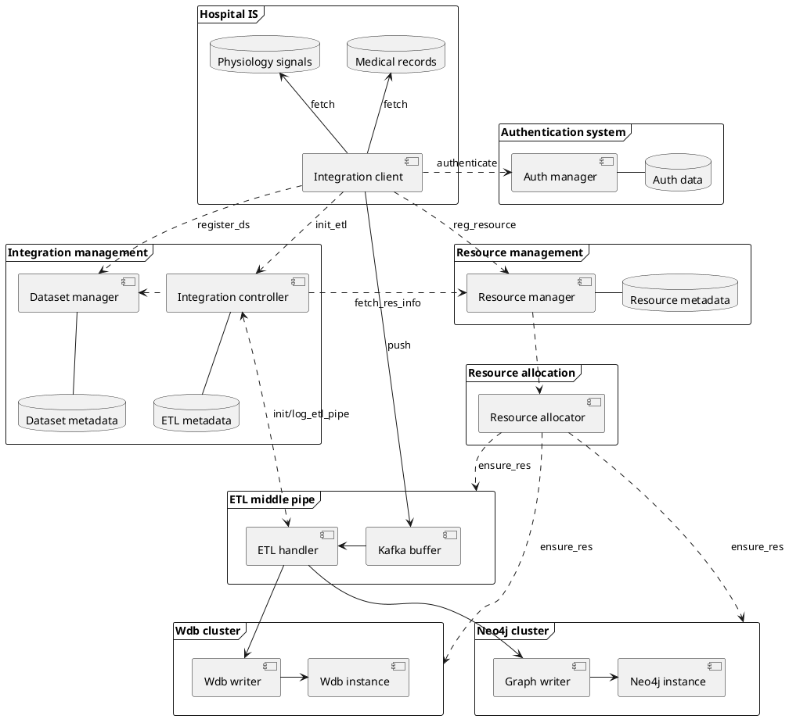

# Grafysi integration
The Grafysi integration system provides functionalities to extract medical records 
and physiology signal data directly from hospital information system or 
from a preprocessed dataset such as MIMIC-III. The extracted data can then be 
processed, partitioned and loaded into Neo4j or Wdb cluster, according 
to data type, in form of Grafysi structured data models for advanced analytics.

Following are grounding features of the system:

1. Ensure health data privacy and security by strictly excluding any sensitive
data from transferring to the outside world (e.g. outside hospital information system)
and provide options to add intermediate pipelines (in form of plugins) to further
filter and process subtle aspects before loading to Grafysi model.
2. ETL types: unlimited-size batch ETL and real-time ETL.
3. Support data partitioning for large-scale graph analytics.
4. Allow hybrid Grafysi data instances hosting or even self-hosted Grafysi data instances for 
ultimate security with the least operational cost by allowing some self-hosted components being managed
by remote controllers.

Below is components diagram of the Grafysi integration system:

In next sections, we will analyse the system architecture around the 4 grounding features.

